# Bookstore Web Application (Client Side)

This repository contains the client-side implementation of a **Bookstore Web Application**, featuring an interactive e-book reader and audiobook player. The backend part of the project can be found [here](https://github.com/eryxmiliaris/bookstore-server).

---

## Table of Contents

1. [Used Technologies](#used-technologies)
2. [Features](#features)
3. [Installation](#installation)
4. [Default Users](#default-users)
5. [Screenshots](#screenshots)

---

## Used Technologies

- **React.js**
- **React Query** for data fetching and caching
- **Axios** for making HTTP requests
- **React Router** for navigation
- **Tailwind CSS** for styling
- **JWT** for authentication

---

## Features

1. **Authentication and Authorization**: Secure user authentication and authorization using JWT tokens.
2. **RESTful API Endpoints**: Well-defined API endpoints for integration with the frontend and third-party services.
3. **E-book Reader and Audiobook Player**: Interactive e-book reader and audiobook player with customizable settings. Reading progress is saved on the server, so users can pick up where they left off, no matter which device they are using.
4. **Book Catalogue**: Catalogue of paper books, e-books and audiobooks with different search criteria, such as title, book types, categories and price range.
5. **Reviews**: User reviews and ratings for books to help people decide whether to buy a book.
6. **Wishlist and Cart**: Wishlist and shopping cart functionalities for users to save desired items and make checkout process easier.
7. **Payments**: Integration with the PayPal Sandbox system for secure payment processing.
8. **Order History**: Order history for users to track past purchases.
9. **Library**: Digital library feature for storing and organizing purchased e-books and audiobooks, providing easy access to content across devices.
10. **Admin Panel**: an admin panel serves as a control center for managing book listings, user orders and reviews.

---

## Installation

1. Install dependencies:
    ```bash
   npm install  
   ```  
2. If the local server port has been changed, update the API base URL in src/constants/appConstants.js:  
    ```javascript
   export const API_BASE_URL = "http://localhost:8080/api";
   ```
3. Start the development server:  
    ```bash
   npm run dev  
   ```  
4. Open your browser and visit http://localhost:5173 (or the URL provided in the command line output).

---

## Default Users

| **Role**       | **Login**     | **Password** |  
|-----------------|---------------|--------------|  
| Admin          | `admin`       | `admin`      |  
| User With Subscription | `usersub`     | `user`       |  
| Regular User    | `usernosub`   | `user`       |  

---

## Screenshots

Catalogue  |  Book page
:------------------------:|:-------------------------:
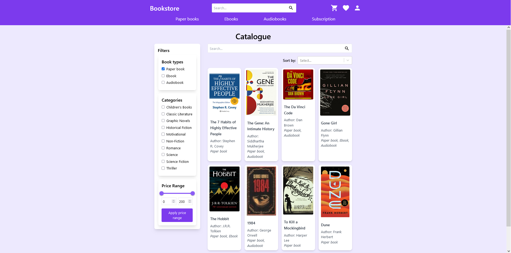  |  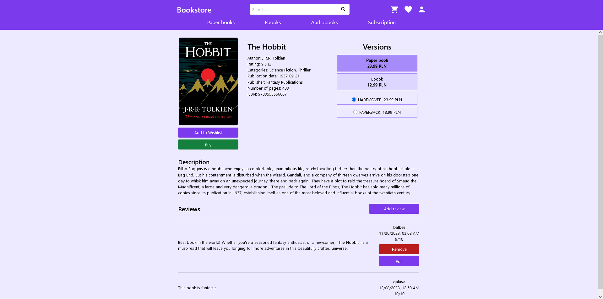

Wishlist  |  User profile
:------------------------:|:-------------------------:
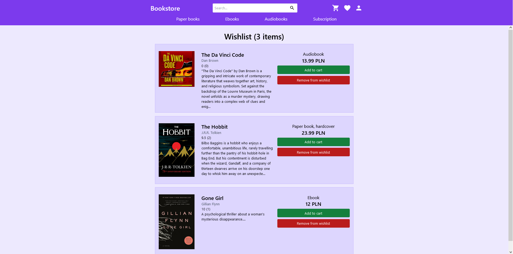  |  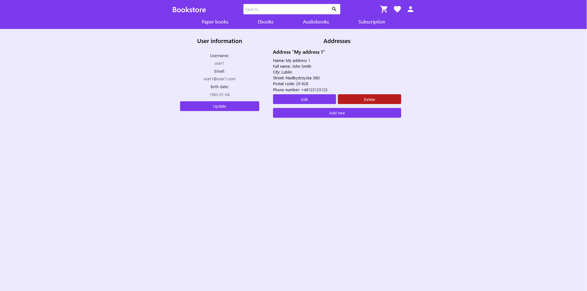

Cart page  |  Library
:------------------------:|:-------------------------:
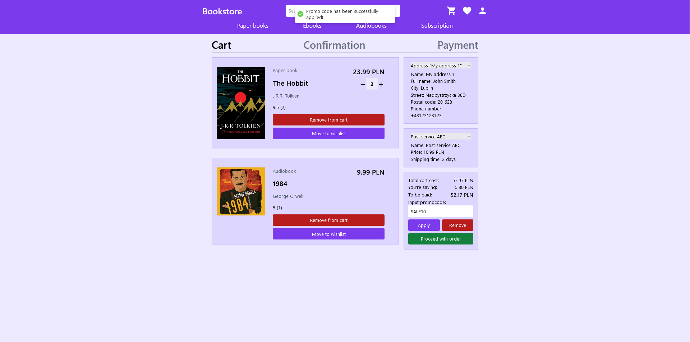  |  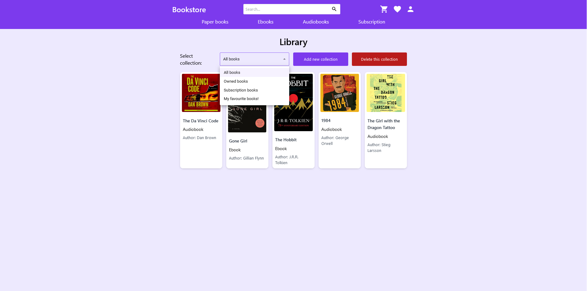

Order history page  |  Audiobook player
:------------------------:|:-------------------------:
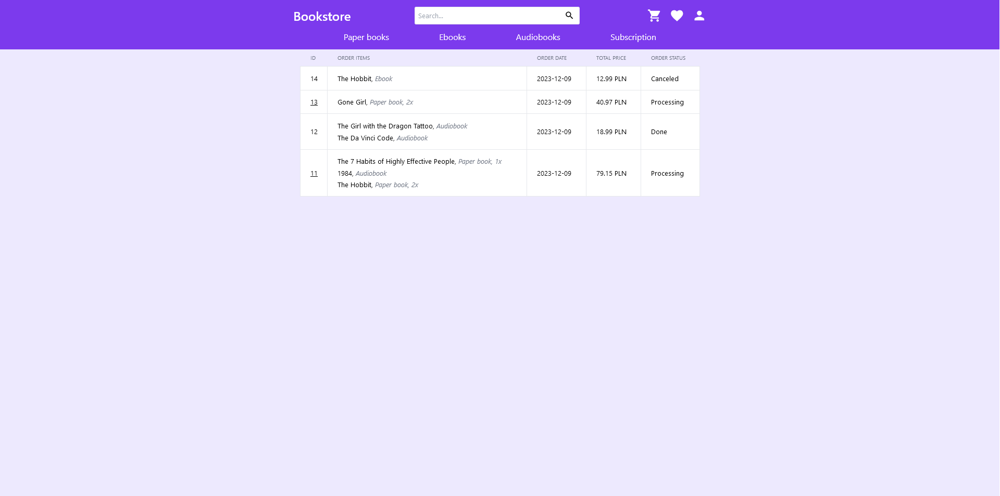  |  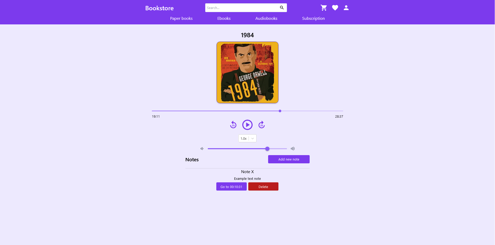

Ebook reader  |  Ebook reader with dark theme
:------------------------:|:-------------------------:
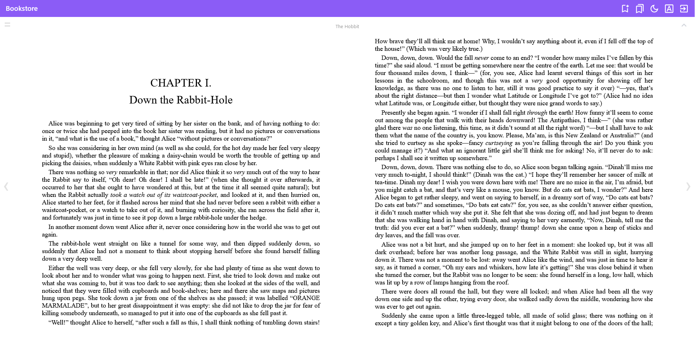  |  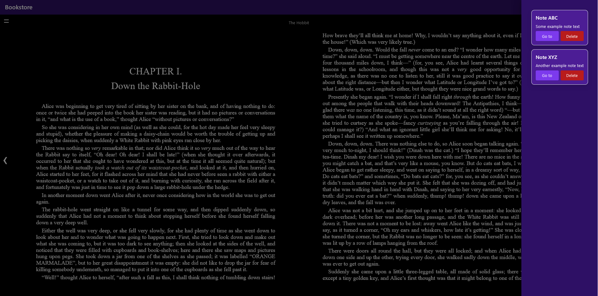

Add book page  |  Edit book page
:------------------------:|:-------------------------:
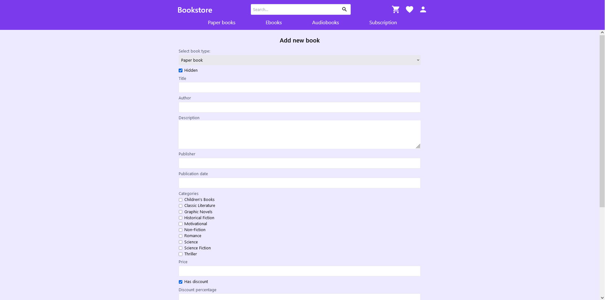  |  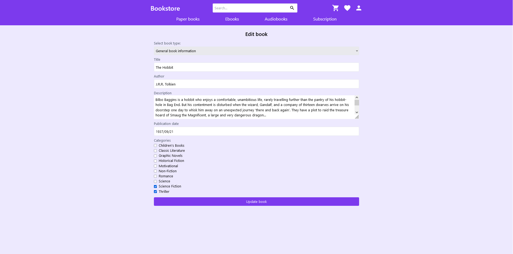
